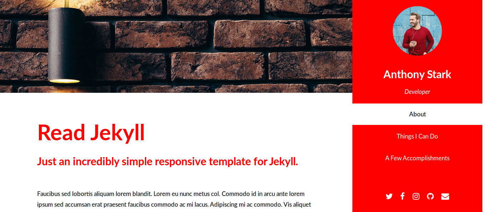

# Read

**Read** is a simple one page **[Jekyll](https://jekyllrb.com/)**  theme developed by **[Fastbyte01](https://github.com/Fastbyte01)** and based on **[ Read Only template](https://html5up.net/read-only)** by **[Html5up](https://html5up.net)**.

**Free** for ***personal and commercial*** use under the **[CCA 3.0 license](https://creativecommons.org/licenses/by/3.0/)**.

All the options and text are directly editable on the [config file](_config.yml), so you don't need to touch the code.

For a demo of the theme you can go **[here](https://readjekyll.fastbyte01.it/)**.

Images courtesy of **[Pexels](https://www.pexels.com/)**:

* [Person holding a black android smartphone](https://www.pexels.com/photo/person-holding-black-android-smartphone-861126/) by [Oleg Magni](https://www.pexels.com/@oleg-magni-293608).

* [Macbook Pro](https://www.pexels.com/photo/macbook-pro-970196/) by [Rawpixel](https://www.pexels.com/@rawpixel).

* [Black suv beside Grey auv crossing the pedestrian line during daytime](https://www.pexels.com/photo/black-suv-beside-grey-auv-crossing-the-pedestrian-line-during-daytime-125514/) by [Kayque Rocha](https://www.pexels.com/@kaiquestr).

* [Photo of a man listening music on his phone](https://www.pexels.com/photo/photo-of-a-man-listening-music-on-his-phone-846741/) by [Bruce Mars](https://www.pexels.com/@olly).

* [Brick brickwall brickwork cement](https://www.pexels.com/photo/brick-brickwall-brickwork-cement-276514/) by [Pixabay](https://www.pexels.com/@pixabay).

All the image used are released under the [CC0](https://creativecommons.org/share-your-work/public-domain/cc0/) license.

Icons used are by [Font Awesome](https://fontawesome.com/).

To change the icons use [this](https://fontawesome.com/v4.7.0/icons/) for reference.

Others code used in **Read** are:

*  [jQuery](jquery.com)

*  html5shiv.js (@afarkas @jdalton @jon_neal @rem)

* [CSS3 Pie](https://css3pie.com)

* [Respond.js](j.mp/respondjs)

* [Skel](skel.io)

